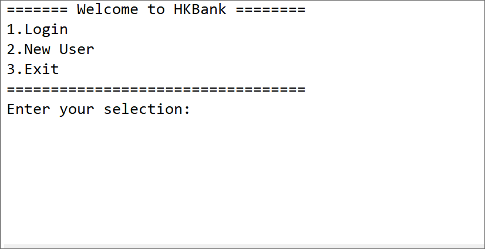

# Console Bank Application in Java

This is a Java mini project of a Bank application with console as front end and serialized object file as back end for persisting data functionality.

## Task Completed

- [x] User login and Admin login
- [x] User can Deposit and Withdraw money form their account
- [x] New User can register for a new account
- [x] New User cannot access account untill Admin approves it
- [x] All User data is persisted via file storage
- [x] Admin only approves new accounts and do not have bank account

## Demo

