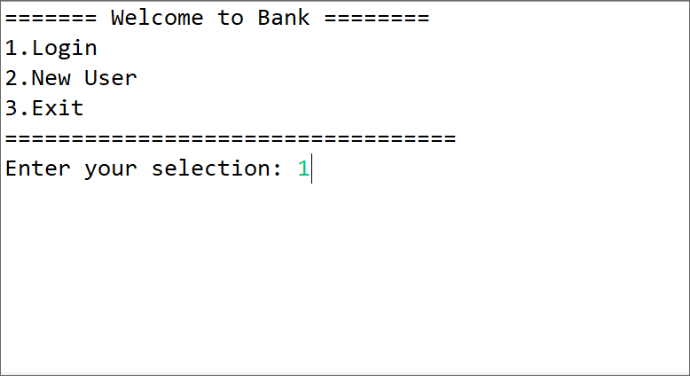
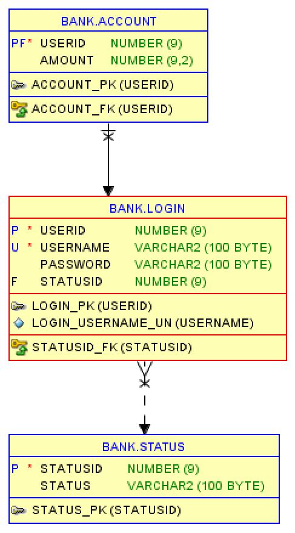

# Console Bank Application in Java

This is a Java mini project of a Bank application with console as front end and Oracle 11g Database as back end for persisting data.

## Task Completed

- [x] User login and Admin login
- [x] User can Deposit and Withdraw money from their account
- [x] New User can register for a new account
- [x] New User cannot access account untill Admin approves it
- [x] All User data is persisted via Oracle Database
- [x] Admin approves new accounts and do not have bank account
- [X] Admin can view exsiting users and acount value
- [x] [Logger](MiniProject2/logs/exampleLog.log) is also to application to track and debug the process
- [x] Junit with Mockito tests essential methods in the application.

## Demo

## Entity Relationship Diagram

