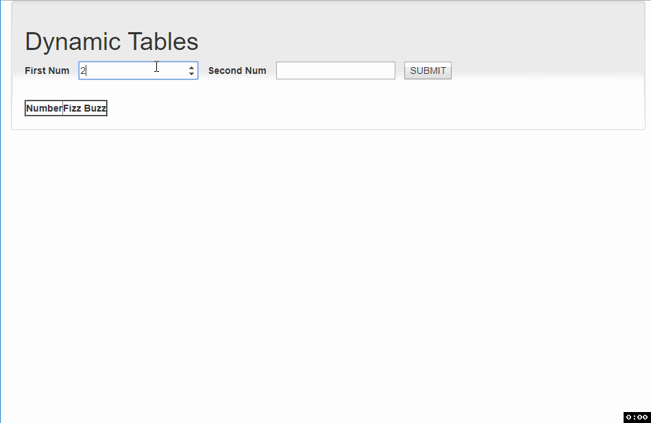

## FizzBuzz project using HTML, CSS with Bootstrap and JavaScript
- [x] Two inputs for one number each
- [x] Generates alert for null values 
- [x] new submissions clear old submission
- [x] Generates alert for number not between 0 - 100
- [x] Dynamic table with one column being the number and the other being the fizzbuzz state

