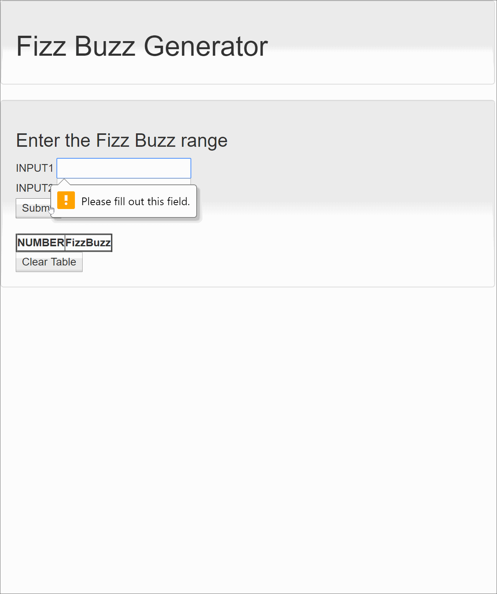

# FizzBuzz using JavaScript

This is a single page Front end web application using maven. 
It takes in two inputs as range and generates a Dynamic FizzBuzz table. 
Front end uses HTML, Bootstrap CSS and JavaScript. 

## Task Completed

- [x] Takes two input values from user.
- [x] Generates Fizz Buzz from low to high of the given input.
- [x] Does not generate Fizz Buzz for null values.
- [x] No value below 0 or above 100 is allowed.
- [x] Dynamic table with given Number and Fizz Buzz state is created.
- [x] All multiple of 3 will print Fizz.
- [x] All multiple of 5 will print Buzz.
- [x] Both multiple of 3 and 5 will print FizzBuzz.
- [x] Clear table option to remove the table contents.

## Demo

